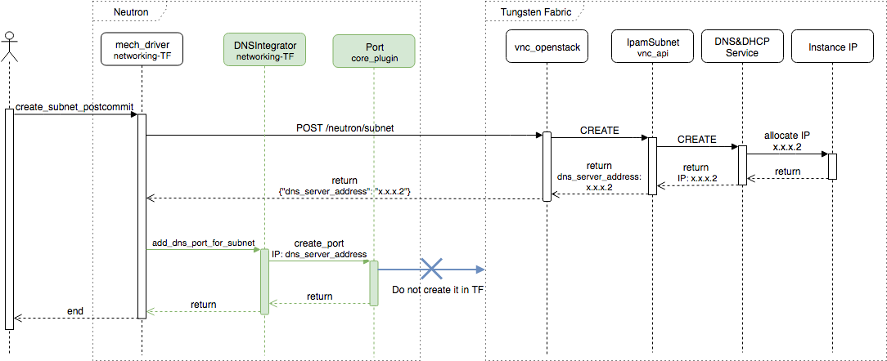

===================================================
Synchronize Neutron with IP allocated for DNS in TF
===================================================

On creating subnet, Tungsten Fabric creates also a service which is used for
DNS and DHCP. This service uses an IP in given subnet (typically this is
``x.x.x.2``), so it's allocated in TF and no other resource should use it.
If Neutron tries to use this IP for any resource, Tungsten Fabric will fail
request to allocate it with error code ``400`` and message
`Conflict: IP address already in use`.

To prevent from using this IP for further resources, plugin creates a port in
Neutron which is not propagated to Tungsten Fabric.

    Flow of creating subnet. Green part is added by Networking-opencontrail
    to prevent Neutron from reusing IP allocated for DNS service.
