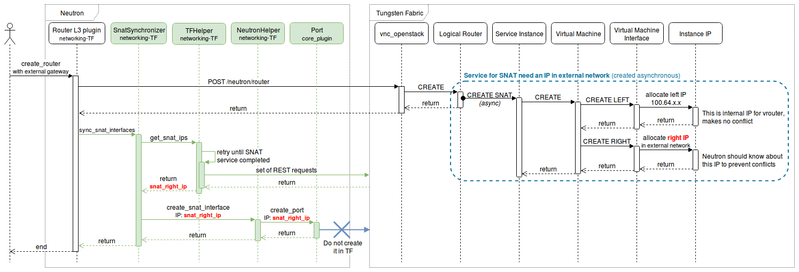
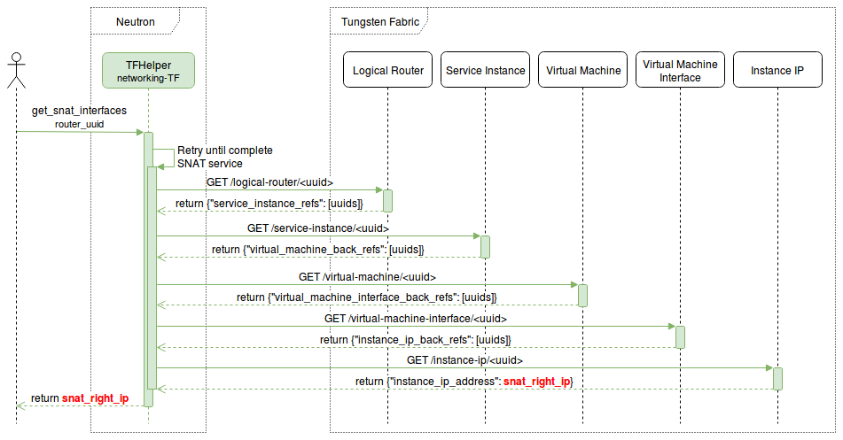
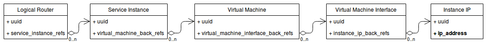

====================================================
Synchronize Neutron with IP allocated for SNAT in TF
====================================================

When a router with an external gateway is created (or an external gateway is
connected to an existing router), Tungsten Fabric creates a SNAT service,
which needs two virtual machine interfaces: one with an internal IP address
used by vrouter (called ``left IP``), and one with an IP address in given
external network (called ``right IP``). This "right" IP adress should be
propagated to Neutron to prevent allocating it to other resources.

The service and both IPs are created asynchronously, so they are not included
in response from Tungsten Fabric. Also ``vnc_opentack`` has no callback to get
this information.

As shown on the diagram, the plugin retrieves the "right" IP address from
TF REST API. Full sequence of requests are shown below. Since the SNAT service
is created asynchronously, the plugin makes a few retries with a small waiting
time to get the "right" IP. After three retries there are no more attempts and
it is assumed that TF did not create any SNAT interfaces.

Tungsten Fabric doesn't include SNAT IPs in any specific place, so it cannot be
retrieved by a simple API call. Instead, to get it, the plugin has to call a
sequence of REST enpoints which are determined by structure of references
between TF objects as seen on the picture below. The plugin retrieves a list of
UUIDs in every step and searches for objects related to SNAT.

